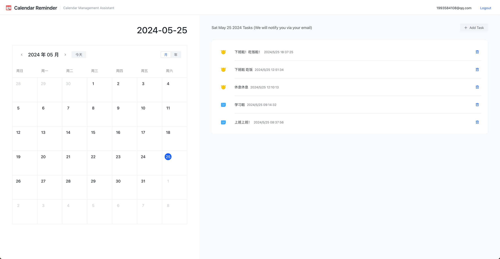
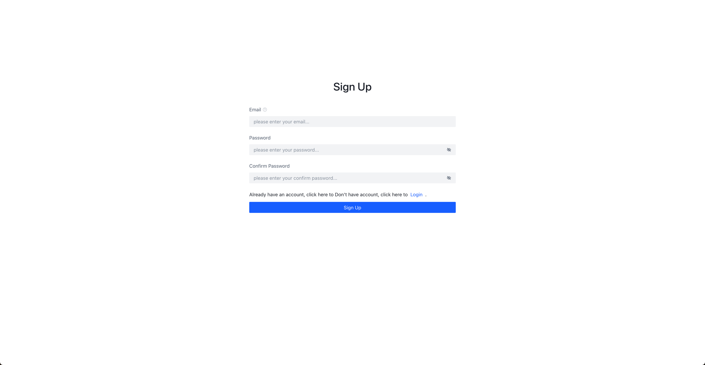
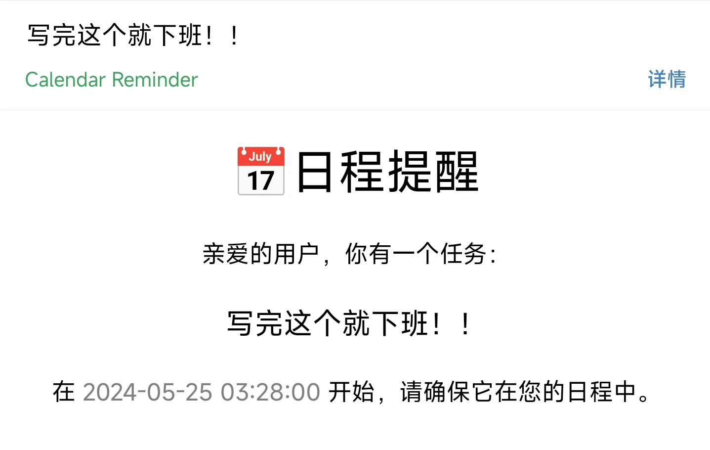

# Calendar Reminder 📅

一个简易的日程管理服务。

**Link**：[API Doc](https://apifox.com/apidoc/shared-ba6e80d9-951a-43aa-84fc-815d6d2b435d) | [~~Dome~~](#)

### 功能

- 便捷地管理自己的日程
- 支持定时 Email 提醒

### 启动

项目支持 Docker-Compose 快速部署，准备工作：

1. 安装 Docker 与Docker-Compose；
2. 配置文件会通过挂载卷的方式挂载到Docker容器，请注意补充 `.env` (see`.env.temp`) 与 `conf/conf_release.yaml` 配置；

通过 Docker-Compose 运行：

```shell
docker-compose up -d
```

### 核心业务

#### 定时任务调度

项目采用手动实现的轻量级定时任务调度器 [crontab](./utils/crontab)，底层基于 [go/time](https://pkg.go.dev/time)
和 [tidwall/tree](https://github.com/tidwall/btree) 实现，在易用性和性能上都表现良好；
相比于 RabbitMQ 的定时消息，该调度器支持直接删除 Waiting 中的任务，并将资源让出给其它任务。

#### 消息推送

通过定时任务定期拉取接下来一段时间区间的定时消息，并提交到定时任务调度器中调度执行；
到达定时消息的推送时间时，调度器会执行处理该消息的回调函数，该函数会该消息推送到 MQ，并交给消费者统一发送邮件，消费端通过重试策略增加服务的可靠。

### DevOps

- 基于 Github Action 完成 Golang Lint、Docker 镜像构建
- 支持 Docker-Compose 一键编排部署

### 应用截图

#### Home



#### Sign Up



#### Email

